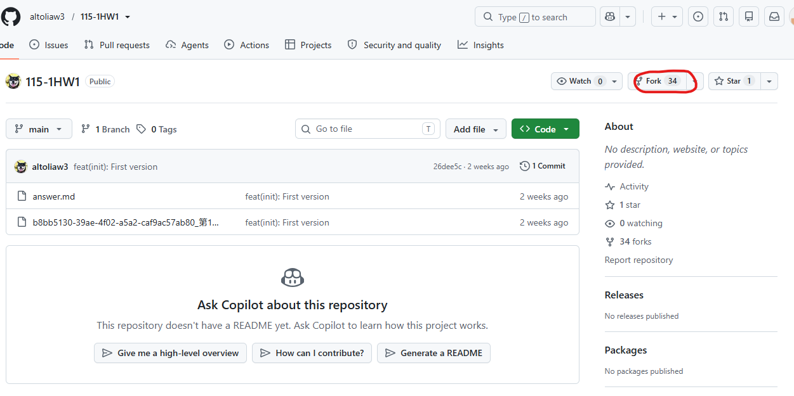

# 第1次作業題目-隨堂-HW1
>
>學號：113111103
><br />
>姓名：林家妤
><br />
>作業撰寫時間：180 (mins，包含程式撰寫時間，換成自己的)
><br />
>最後撰寫文件日期：2026/10/10
>

本份文件包含以下主題：(至少需下面兩項，若是有多者可以自行新增)
- [x] 說明內容
- [x] 其他 (可以包含心得或是想跟老師反映)

## 說明內容

開始寫說明，該說明需說明想法，
並於之後再對上述想法的每一部分將程式進一步進行展現，
若需引用程式區則使用下面方法，
若為.cs檔內程式除了於敘述中需註明檔案名稱外，
還需使用語法` ```語言種類 程式碼 ``` `，其中語言種類若是要用python則使用py，java則使用java，C/C++則使用cpp，
下段程式碼為語言種類選擇csharp使用後結果：

```csharp
public void mt_getResult(){
    ...
}
```

若要於內文中標示部分網頁檔，則使用以下標籤` ```html 程式碼 ``` `，
下段程式碼則為使用後結果：

```html
<%@ Page Language="C#" AutoEventWireup="true" ...>

<!DOCTYPE html>

<html xmlns="http://www.w3.org/1999/xhtml">
<head runat="server">
<meta http-equiv="Content-Type" ...>
    <title></title>
</head>
<body>
    <form id="form1" runat="server">
        <div>
        </div>
    </form>
</body>
</html>
```
更多markdown方法可參閱[https://ithelp.ithome.com.tw/articles/10203758](https://ithelp.ithome.com.tw/articles/10203758)

請在撰寫"說明程式與內容"該塊內容，請把原該塊內上述敘述刪除，該塊上述內容只是用來指引該怎麼撰寫內容。

1. 

Ans: 首先點進去連結，到達老師的伺服器端倉庫中，上面會看到一個fork按鈕(紅色圈起來的)，直接按下去，會出現顯示要把該倉庫fork到你的倉庫中，不用動任何東西，滑到最下面點Create fork就好(由於我複製過了無法重新獲得該畫面截圖)，之後回到自己的伺服器端重新整理，看到有一樣的倉庫名表示fork成功。


2. 

Ans:

3. 

Ans:


4. 

Ans:

## 其他